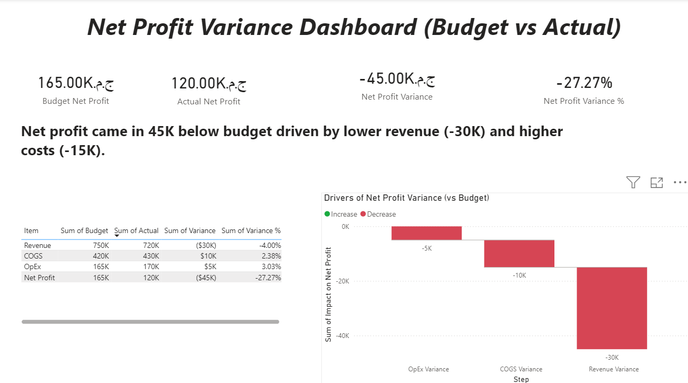
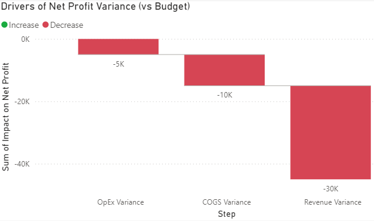
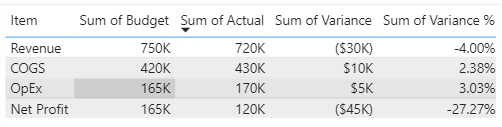

# Net Profit Variance Dashboard (Budget vs Actual) | لوحة انحراف صافي الربح (المخطط مقابل الفعلي)

## Overview | نظرة عامة
This project compares **Budget vs Actual** results and explains the drivers behind **Net Profit variance** using a waterfall (bridge) analysis in Power BI.  
يقدّم هذا المشروع مقارنة بين **المخطط والفعلي** ويشرح أسباب **انحراف صافي الربح** باستخدام تحليل الشلال (Bridge/Waterfall) داخل Power BI.

## Tools | الأدوات
- Excel (data prep + calculations) | Excel (تجهيز البيانات والحسابات)
- Power BI (DAX + dashboard) | Power BI (معادلات DAX + لوحة معلومات)

## Key Metrics | أهم المؤشرات
- Budget Net Profit | صافي الربح المخطط
- Actual Net Profit | صافي الربح الفعلي
- Net Profit Variance | انحراف صافي الربح
- Net Profit Variance % | نسبة انحراف صافي الربح

## Insight | الخلاصة التحليلية
Net profit came in **45K below budget** driven by **lower revenue (-30K)** and **higher costs (-15K)**.  
جاء صافي الربح **أقل من المخطط بـ 45 ألف** بسبب **انخفاض الإيرادات (-30 ألف)** و**ارتفاع التكاليف (-15 ألف)**.

## Dashboard Preview | معاينة الداشبورد


## Waterfall | شارت الشلال


## Variance Table | جدول الانحراف


## Files | الملفات
- `Net_Profit_Variance_Dashboard.pbix` — Power BI dashboard | ملف الداشبورد
- `Finance_Data_Analyst_Practice.xlsx` — Excel source data | ملف بيانات الإكسيل

## How to Run | طريقة التشغيل
1. Download the `.pbix` and `.xlsx` files. | حمّل ملفي `.pbix` و `.xlsx`.
2. Open the PBIX in **Power BI Desktop**. | افتح ملف الـ PBIX باستخدام **Power BI Desktop**.
3. If prompted, update the data source path to the Excel file. | إذا طُلب منك تحديد مصدر البيانات، اختر ملف الإكسيل.
4. Refresh the report. | اضغط **Refresh** لتحديث البيانات.

## DAX Measures (Main) | أهم معادلات DAX
```DAX
Budget Net Profit =
CALCULATE(
    SUM(Variance[Budget]),
    Variance[Item] = "Net Profit"
)

Actual Net Profit =
CALCULATE(
    SUM(Variance[Actual]),
    Variance[Item] = "Net Profit"
)

Net Profit Variance =
[Actual Net Profit] - [Budget Net Profit]

Net Profit Variance % =
DIVIDE([Net Profit Variance], [Budget Net Profit])

