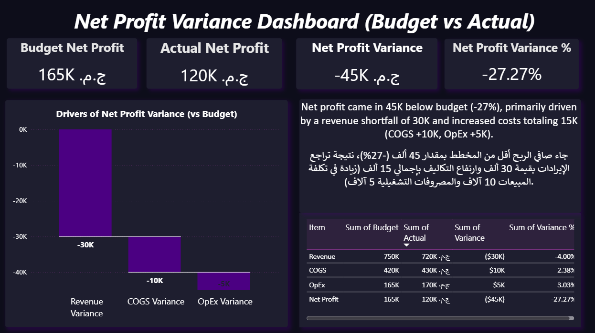
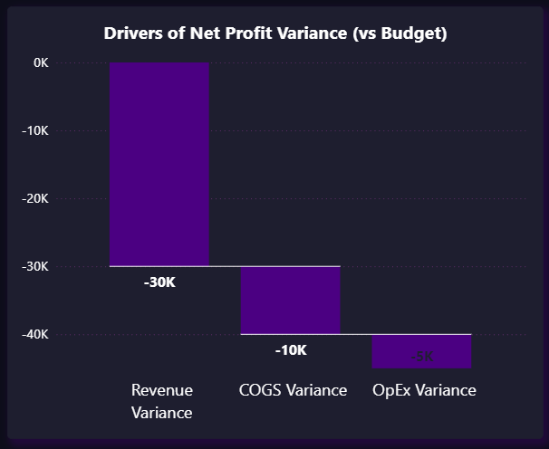
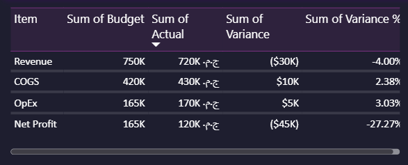

## \# Net Profit Variance Dashboard (Budget vs Actual)

## \## Financial Performance \& Variance Analysis | تحليل الأداء المالي وانحراف صافي الربح

## 

## ---

## 

## \## Overview | نظرة عامة

## This project analyzes the variance between Budget and Actual financial performance and identifies the key drivers impacting Net Profit using a structured waterfall (bridge) analysis in Power BI.

## 

## The dashboard transforms raw financial data into a clear executive-level summary highlighting performance gaps and profitability drivers.

## 

## يقدّم هذا المشروع تحليلًا لانحراف صافي الربح بين المخطط والفعلي باستخدام Power BI، مع عرض بصري مبسّط يساعد الإدارة على فهم أسباب التراجع في الربحية.

## 

## ---

## 

## \## 🛠 Tools \& Technologies

## \- \*\*Excel\*\* – Data structuring and financial preparation  

## \- \*\*Power BI\*\* – Data modeling \& visualization  

## \- \*\*DAX\*\* – KPI calculations and variance logic  

## 

## ---

## 

## \## 📊 Core Financial Measures Used in the Model

## \- Budget Net Profit  

## \- Actual Net Profit  

## \- Net Profit Variance  

## \- Net Profit Variance %  

## \- Revenue Variance  

## \- COGS Variance  

## \- Operating Expense Variance  

## 

## ---

## 

## \## 📈 Executive Insight

## Net profit came in \*\*45K below budget (-27%)\*\*, primarily driven by a \*\*revenue shortfall of 30K\*\* and \*\*increased costs totaling 15K (COGS +10K, OpEx +5K).\*\*

## 

## جاء صافي الربح أقل من المخطط بمقدار \*\*45 ألف (-27%)\*\* نتيجة تراجع الإيرادات بقيمة 30 ألف وارتفاع إجمالي التكاليف بقيمة 15 ألف.

## 

## ---

## 

## 📷 Dashboard Preview

## 

## ---

## 

## \## 🔎 Waterfall Analysis

## The waterfall chart bridges Budget Net Profit to Actual Net Profit by breaking down:

## \- Revenue Impact  

## \- COGS Impact  

## \- Operating Expense Impact  

## 


## 

## ---

## 

## \## 📋 Variance Table

## Detailed financial breakdown supporting the variance logic and waterfall structure.

## 

## 📷 Variance Table

## 

## ---

## 

## \## 📁 Project Structure

## ```

## net-profit-variance-dashboard

## │  README.md

## │

## ├─ data

## │   Finance\_Data\_Analyst\_Practice.xlsx

## │

## ├─ pbix

## │   Net\_Profit\_Variance\_Dashboard.pbix

## │

## └─ screenshots

## &nbsp;   dashboard.png

## &nbsp;   waterfall.png

## &nbsp;   variance\_table.png

## ```

## 

## ---

## 

## \## 🚀 How to Use

## 1\. Open the `.pbix` file in Power BI Desktop.

## 2\. Connect to the Excel file if prompted.

## 3\. Refresh the dataset.

## 4\. Review variance drivers through the KPI cards and waterfall analysis.

## 

## ---

## 

## \## 🧠 Skills Demonstrated

## \- Financial Variance Analysis  

## \- KPI Development  

## \- DAX Calculations  

## \- Data Modeling  

## \- Executive Reporting  

## \- Data Storytelling  

## 

## ---

## ---

## ⚠️ Limitations | القيود
- The dataset used is a structured sample dataset for demonstration purposes and does not represent real company financial data.
- The analysis is based on a single reporting period and does not include multi-year comparison (YoY analysis).
- The dashboard focuses on high-level executive metrics without drill-through to transaction-level details.
- The data source is Excel-based and not connected to a live database (e.g., SQL Server).
  
- البيانات المستخدمة هي بيانات تجريبية منظمة لأغراض العرض ولا تمثل بيانات مالية حقيقية لشركة فعلية.
- التحليل يعتمد على فترة تقارير واحدة فقط ولا يشمل مقارنة متعددة السنوات (YoY).
- يركّز الداشبورد على مؤشرات تنفيذية عالية المستوى دون إمكانية التعمق حتى مستوى العمليات التفصيلية.
- مصدر البيانات يعتمد على ملف Excel وغير مرتبط بقاعدة بيانات مباشرة مثل SQL Server.

---

## 🚀 Future Improvements | التطوير المستقبلي

- Add multi-period comparison (MoM / YoY) to enhance performance tracking.
- Integrate SQL Server as a dynamic data source instead of static Excel files.
- Implement What-If parameters for dynamic revenue and cost scenario simulations.
- Apply Row-Level Security (RLS) to simulate role-based financial reporting.
- Improve scalability by redesigning the model using a star schema structure.

- إضافة مقارنة متعددة الفترات (شهري/سنوي) لتعزيز متابعة الأداء.
- ربط المشروع بقاعدة بيانات SQL Server كمصدر بيانات ديناميكي بدلاً من ملفات Excel ثابتة.
- تطبيق What-If Parameters لمحاكاة سيناريوهات مختلفة للإيرادات والتكاليف.
- تطبيق نظام صلاحيات (Row-Level Security) لمحاكاة تقارير مالية حسب الأدوار الوظيفية.
- تحسين قابلية التوسع من خلال إعادة تصميم النموذج باستخدام هيكل Star Schema.
---

## \## 👤 Author

## Ahmed Samir Toukhy  

## Data Analyst | Power BI \& Financial Analysis


